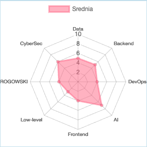
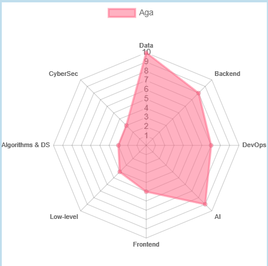
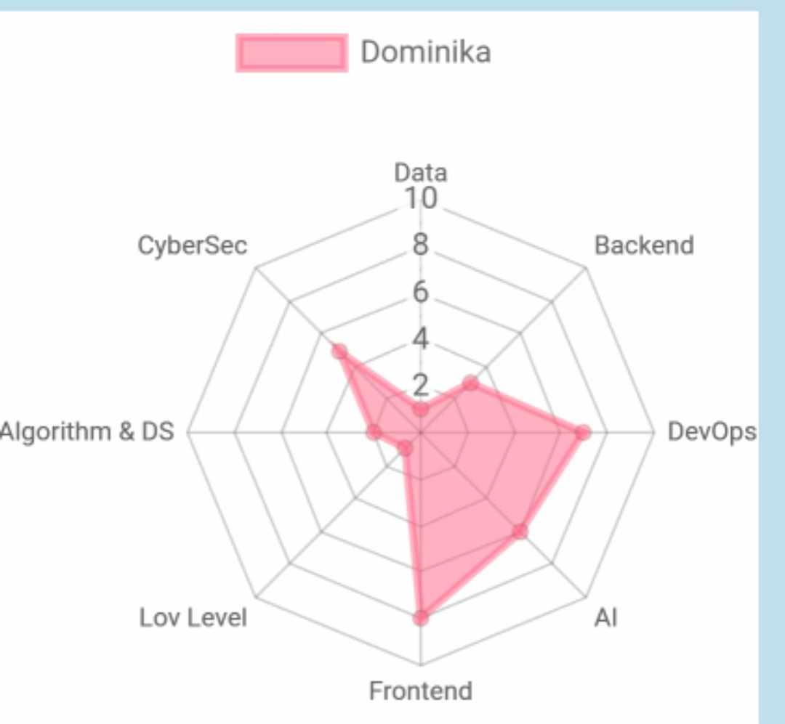
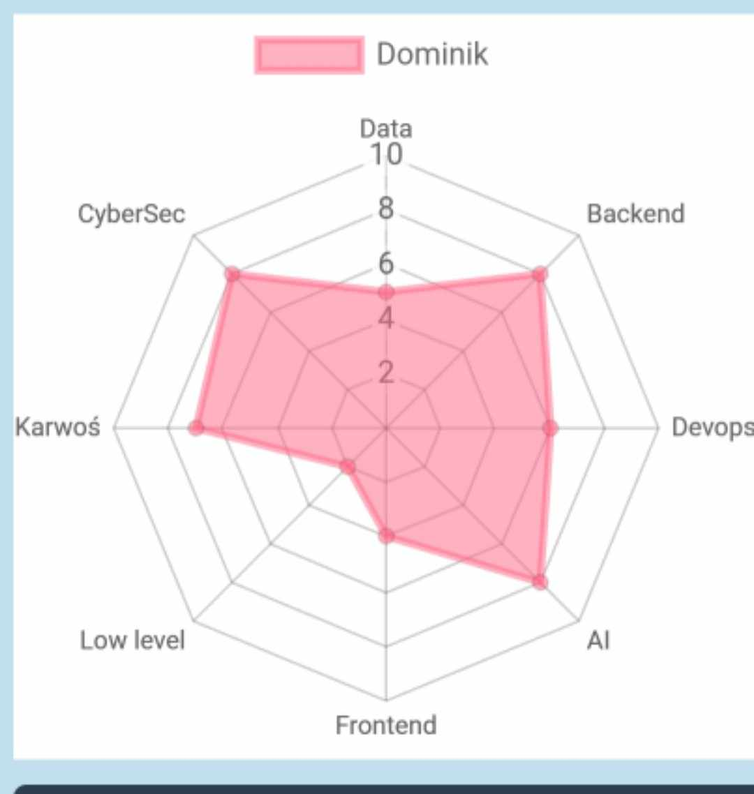
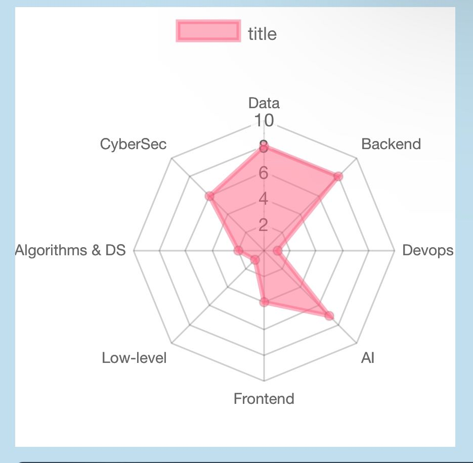

# Organization

## Team

- [Aga](#aga)
- [Dominika](#dominika)
- [Dominik](#dominik)
- [Michał](#michal)
- [c00b](#c00b)

## Avg. interest 

## Aga

Najbardziej tak:
- Data
- AI
- Backend/DevOps

Najbardziej nie:
- CyberSec
- A&DS
- LL

Charakterystyka:
- Data Enigneering/Science

## Dominika

Najbardziej tak:
- Frontend
- AI
- CyberSec/DevOps

Najbardziej nie:
- Data
- A&DS
- LL

Charakterystyka:
- Fullstack 80/20 front/devops, LangChain

## Dominik

Najbardziej tak:
- AI
- CyberSec
- Backend/Karwoś

Najbardziej nie:
- Data
- Front
- LL

Charakterystyka:
- Backend

## Michal

Najbardziej tak:
- Backend
- Data
- CyberSec/AI

Najbardziej nie:
- DevOps
- A&DS
- LL

Charakterystyka:
- Backend

## c00b

Najbardziej tak:
- LL
- CyberSec
- AI/A&DS

Najbardziej nie:
- Backend
- Frontend
- Data/DevOps

Charakterystyka:
- Embedded/Quality